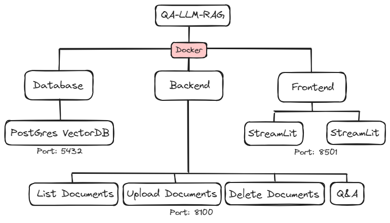
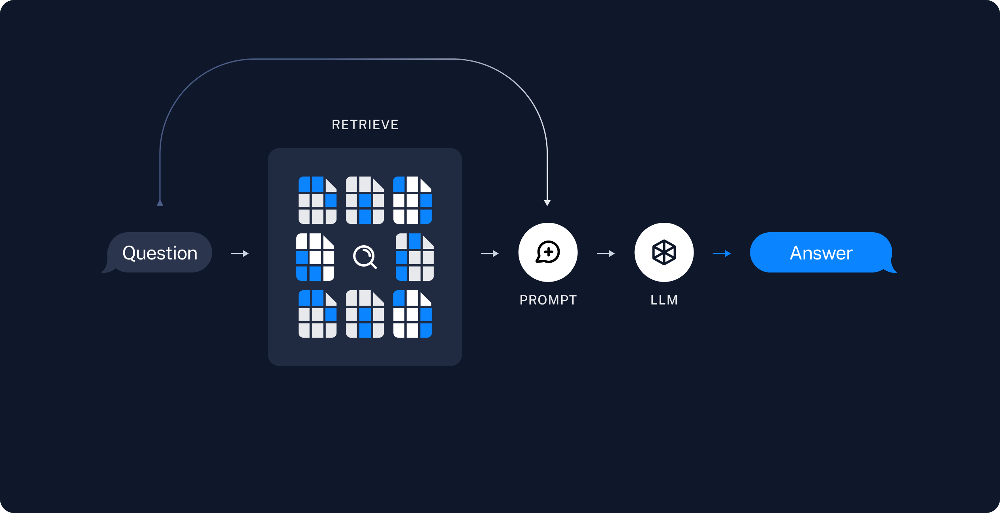

# Document-based Q&A System

This project is a web-based application that allows users to upload documents, delete them, and ask questions based on the content of the uploaded documents. It utilizes a backend service to process documents and answer questions using Large Language Models (LLMs).

## Features

- **Upload Documents**: Users can upload documents in various formats (PDF, DOC, DOCX, TXT) for processing.
- **View Uploaded Documents**: Displays a list of currently uploaded documents.
- **Delete Documents**: Allows users to remove documents from the system.
- **Ask Questions**: Users can ask questions, and the system will provide answers based on the content of the uploaded documents.
- **Choose LLM Model**: Users can select which LLM model to use for answering questions.

## Installation

To run this project, you will need Python and Docker installed on your system. Follow these steps:

1. Clone the repository:

```bash
git clone https://github.com/raminmardani/QA-LLM-RAG
```

2. Navigate to the project directory:

```bash
cd QA-LLM-RAG
```

3. Deploy the docker locally:

```bash
docker-compose up --build
```

## Usage

After starting the application, navigate to the URL `http://localhost:8501`. From there, you can use the web interface to upload documents, view the list of uploaded documents, delete documents, and ask questions.

## Backend Service

The application relies on a backend service specified by the `http://localhost:8100/llm-rag/docs`. This service should expose endpoints for listing documents, uploading documents, deleting documents, and answering questions.

## Workflow & Functionality Map





